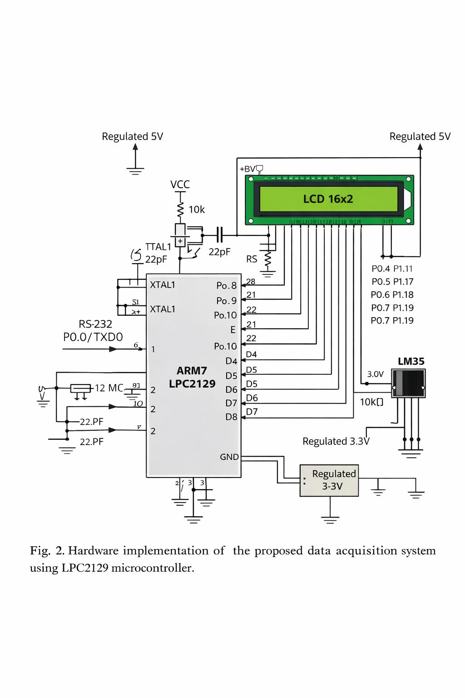

# Advanced Data Acquisition System (DAS)

##  Overview
This project implements an Advanced Data Acquisition System using LPC2129 microcontroller. It collects real-time data from sensors using ADC and processes it for monitoring and analysis.

##  Features
- ADC interfacing with LPC2129
- Real-time data acquisition
- Serial communication (UART)
- Sensor integration
- Embedded C implementation

##  Technologies Used
- Embedded C
- LPC2129 ARM7 Microcontroller
- Keil uVision
- Proteus (Simulation)

##  Applications
- Industrial monitoring
- Environmental sensing
- Automation systems

##  Project Structure
- Source Code (.c, .h)
- Circuit Design
- Documentation

##  Future Improvements
- IoT integration
- Wireless data transmission
- Cloud monitoring

## Hardware Implementation

##  Author
M. Chakradhar Reddy
